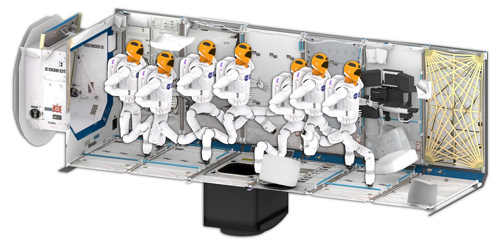

# ompl_tutorials

Open Motion Planning Library (OMPL) をC++で使用するためのチュートリアル。
ビルドシステムにはCMakeを使用する。

<div align="left">


</div>

## Installation
執筆時点（2022/06/08）でのインストール方法を示す（実行環境は以下）。
原則、[OMPL公式サイトのインストールガイド](https://ompl.kavrakilab.org/installation.html)に沿ってインストールすれば問題ない。

**Environment** 
- OS: Ubuntu 18.04
- ROS Melodic
- OMPL: 1.4 (ROS Melodic uses this version)
- CMake: 2.8.0

#### ROSをインストールしている場合
ROSをインストールしている場合は、ROSバージョンのOMPLを使用する。
**ROS Melodicを使用する場合はOMPL 1.4がインストールされる。最新のバージョンとは異なるため、Demoプログラムが公式のままでは動かない場合がある点に注意**
```bash
sudo apt-get update
sudo apt install ros-$ROS_DISTRO-ompl
```
#### ROSをインストールしていない場合
aptリポジトリからOMPLのライブラリをインストールする。
```bash
sudo apt install libompl-dev ompl-demos
```

## Build with CMake
ここでは例として、`rigid_body_planning`というデモプログラムをビルドする手順を示す。他のデモについても同様の手順でビルドすることができる。

まずはソースコードまで移動し、`build`ディレクトリを作成する。
その後、事前に用意してある`CMakeLists.txt`を使ってビルドを行う。
```bash
cd demos/rigid_body_planning
mkdir build
cd build
cmake ../
make
```

ビルドが成功した場合は、`build`ディレクトリ内に`Main`という実行ファイルが生成されるはずである。

ここで、`CMakeLists.txt`の中身は以下のようになっている。
```cmake
cmake_minimum_required(VERSION 2.8)
project(rigid_body_planning)

find_package(ompl REQUIRED)

include_directories(
  /usr/include/eigen3
  ${OMPL_INCLUDE_DIRS}
)

add_executable (Main main.cpp)
target_link_libraries (Main ${OMPL_LIBRARIES})
```
OMPLを使用する際にはまず、`find_package(ompl REQUIRED)`を記述する。これにより、以下のようなマクロを一括で取得することができる。
- `OMPL_FOUND`
ライブラリの検索状態。(TRUE）
- `OMPL_INCLUDE_DIRS`
インクルードファイルが含まれるディレクトリのパス。(e.g. C:\Program Files\LIBRARY\inc)
- `OMPL_LIBRARIES`
ライブラリファイルのパス。(e.g. C:\Program Files\LIBRARY\lib\LIBRARY.lib)
- `OMPL_DEFINITIONS`
プリプロセッサの定義。(e.g. LIBRARY_DEFINE)
- `OMPL_VERSION`
OMPLのバージョン

また、`include_directories`でプロジェクトにOMPLライブラリを追加し、`target_link_libraries`でOMPLライブラリを依存ファイルとして設定している。<br>
ここで、**`include_directories`中に`/usr/include/eigen3`も入れている点に注意！！この記述がないとビルドエラーになる。** なぜEigen3ライブラリのパスが通っていないのかは謎...

`CMakeLists.txt`の書き方についてもう少し詳しく知りたい方は、[Wiki: CMakeLists Tutorial](../wikis/CMakeLists Tutorial)を参照のこと。

## Execute
`build`ディレクトリ内に生成された実行ファイルを起動する。
```bash
./Main
```

## Reference
- [The Open Motion Planning Library](https://ompl.kavrakilab.org/index.html)
OMPLの公式サイト

